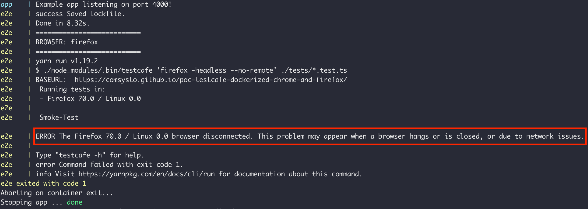

# poc-testcafe-dockerized-chrome-and-firefox

This is a simple Proof of Concept about using [Testcafe](https://devexpress.github.io/testcafe/) dockerized with docker-compose and dockerized apps.

### Prerequisites

Have this installed:

- Docker
- Docker compose
- yarn
- NodeJS 12 LTS

&nbsp;

### Running dockerized Tests

```
git clone https://github.com/comsysto/poc-testcafe-dockerized-chrome-and-firefox.git
cd poc-testcafe-dockerized-chrome-and-firefox
yarn

yarn test:firefox
# XOR
yarn test:chrome
```

In the `docker-compose-e2e.yml` happens all the magic. It starts the app dockerized and a separate container for the e2e tests running the browsers and testcafe.

&nbsp;

### Error with Firefox

Only on Ubuntu 18.04 I get errors with firefox. It works on macOS.



- :red_circle: Does not work on Ubuntu Server 18.04 with docker ce 18.09.7
- :red_circle: Does not work on Ubuntu Server 18.04 with docker ce 19.03.5
- :white_check_mark: Does work on macOS Catalina with docker desktop ce 19.03.5
